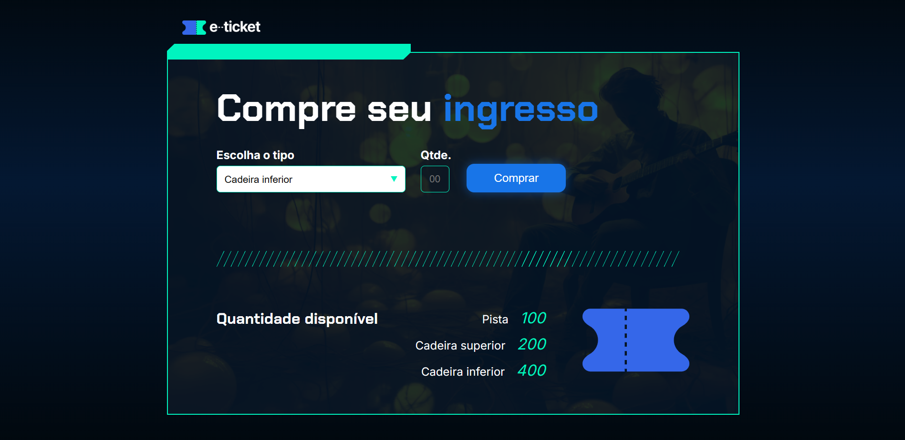

<!--Copyright (c) 2024 Fernanda Kipper Bucoski de Sousa-->

[JAVASCRIPT__BADGE]: https://img.shields.io/badge/Javascript-000?style=for-the-badge&logo=javascript

<h1 align="center" style="font-weight: bold;">Comprar Ingressos 💻</h1>

![javascript][JAVASCRIPT__BADGE]

<p align="center">
    
</p>

<h2 id="started">📌 Sobre</h2>

A interface para compra de ingressos foi um projeto realizado durante um curso da Alura. O qual, consiste no usuário escolher um tipo de ingresso e a quantidade que deseja. Além disso, terá que ser subtraído a quantidade escolhida pelo usuário na tela e existirão regras que não permitirão compras acima da quantidade existente.

<h2>Clonando o projeto</h2>

Como clonar o projeto:

```bash
git clone https://github.com/AlissonSimon/Ingresso.git
```
